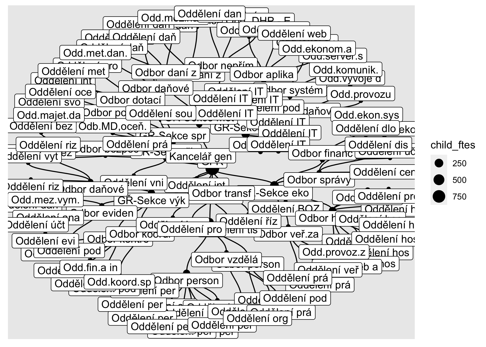

# Mapa státu


This repo contains the code to transform raw open data on the org
structure of Czech public authorities (služební úřady) into useable data
and a website for exploration.

<!-- README.md is generated from README.Rmd. Please edit that file -->

### Organisational structures

This data is published as one large XML file for all “služební úřady”,
i.e. organisations governed by Služební zákon, the Civil Service Act. It
lists all organisational units within these organisations along their
unique and internal IDs, names, parents (subordinate) units and staff
counts (service an contract roles).

In practice:

-   some ministries do not break down their units to the lowest level
    (MZV and MV leave out the bottom level)
-   names and abbrevietations are inputted differently by different
    orgs - some list include numbers, some names are in fact
    abbreviations etc., which makes text searching difficult
-   staff counts are missing for most orgs and undocumented, i.e. it is
    not clear whether it is actual contracts (occupied slots) or slots
    regardless of whether they are occupied; also not clear if it is
    FTEs or headcount/position counts.

The code here transforms that data into

-   a graph and its components (nodes and edges) which forms a tree.
    This can be analysed in R via packages that can work with graphs
    (e.g. tidygraph, ggraph) or in other tools using the tables of nodes
    and edges (visNetwork)
-   a hierarchical table, listing all units, where each row denotes a
    units lowest in the hierarchy and columns list all its parents, one
    level per column. This is useful for search or for visualisation
    using e.g. D3network, tree mark in Observable Plot or the
    CollapsibleTree package.

This data is exported as CSV in data-export

For more info on data on public servants see [recent
report](https://idea.cerge-ei.cz/zpravy/statni-zamestnanci-a-urednici-kde-pracuji-a-za-kolik)
and [related repo](https://github.com/dan-bart/urednici_2021), plus an
[older overview of available
sources](https://petrbouchal.xyz/urednici/).

#### Preview



Graph

    # A tbl_graph: 9447 nodes and 9446 edges
    #
    # A rooted tree
    #
    # A tibble: 9,446 × 2
       from    to
      <int> <int>
    1  9446     1
    2     1     2
    3     1     3
    4     1     4
    5     1     5
    6     1     6
    # ℹ 9,440 more rows
    #
    # A tibble: 9,447 × 18
      name    nazev mista_prac mista_sluz predstaveny id_ext urad_zkratka urad_nazev
      <chr>   <chr>      <dbl>      <dbl> <chr>       <chr>  <chr>        <chr>     
    1 110000… Úřad…          0          0 <NA>        1      ÚV ČR        Úřad vlád…
    2 120030… Oddě…          0          3 true        100310 ÚV ČR        Úřad vlád…
    3 120031… Oddě…          0          8 true        220330 ÚV ČR        Úřad vlád…
    # ℹ 9,444 more rows
    # ℹ 10 more variables: zkratka <chr>, urad_skupina <chr>, label <chr>,
    #   analyticky <lgl>, nazev_lower <chr>, categ <chr>, color <chr>,
    #   mista_celkem <dbl>, dpth <int>, child_ftes <dbl>

Nodes

    # A tibble: 9,447 × 18
       id     nazev mista_prac mista_sluz predstaveny id_ext urad_zkratka urad_nazev
       <chr>  <chr>      <dbl>      <dbl> <chr>       <chr>  <chr>        <chr>     
     1 11000… Úřad…          0          0 <NA>        1      ÚV ČR        Úřad vlád…
     2 12003… Oddě…          0          3 true        100310 ÚV ČR        Úřad vlád…
     3 12003… Oddě…          0          8 true        220330 ÚV ČR        Úřad vlád…
     4 12012… Sekc…          3          1 true        120000 ÚV ČR        Úřad vlád…
     5 12012… Mini…          0          0 <NA>        300000 ÚV ČR        Úřad vlád…
     6 12012… Mini…          0          0 <NA>        700000 ÚV ČR        Úřad vlád…
     7 12012… Míst…          0          0 <NA>        800000 ÚV ČR        Úřad vlád…
     8 12011… Odd.…          4          0 <NA>        100040 ÚV ČR        Úřad vlád…
     9 12012… Oddě…          3          0 <NA>        270200 ÚV ČR        Úřad vlád…
    10 12003… Sekc…          1          2 true        130000 ÚV ČR        Úřad vlád…
    # ℹ 9,437 more rows
    # ℹ 10 more variables: zkratka <chr>, urad_skupina <chr>, label <chr>,
    #   analyticky <lgl>, nazev_lower <chr>, categ <chr>, color <chr>,
    #   mista_celkem <dbl>, dpth <int>, child_ftes <dbl>

Edges

    # A tibble: 9,446 × 2
       from     to      
       <chr>    <chr>   
     1 stat     11000002
     2 11000002 12003059
     3 11000002 12003104
     4 11000002 12012227
     5 11000002 12012228
     6 11000002 12012281
     7 11000002 12012287
     8 11000002 12011241
     9 11000002 12012443
    10 11000002 12003084
    # ℹ 9,436 more rows

Table

    # A tibble: 7,180 × 14
       level1_id level1_nazev  level2_id level2_nazev         level3_id level3_nazev
       <chr>     <chr>         <chr>     <chr>                <chr>     <chr>       
     1 11000002  Úřad vlády ČR 12003059  Oddělení interního … <NA>      <NA>        
     2 11000002  Úřad vlády ČR 12003104  Oddělení vnitřní be… <NA>      <NA>        
     3 11000002  Úřad vlády ČR 12012227  Sekce pro právo a e… 12003061  Odbor právn…
     4 11000002  Úřad vlády ČR 12012227  Sekce pro právo a e… 12003061  Odbor právn…
     5 11000002  Úřad vlády ČR 12012227  Sekce pro právo a e… 12003061  Odbor právn…
     6 11000002  Úřad vlády ČR 12012227  Sekce pro právo a e… 12003081  Odbor správ…
     7 11000002  Úřad vlády ČR 12012227  Sekce pro právo a e… 12003081  Odbor správ…
     8 11000002  Úřad vlády ČR 12012227  Sekce pro právo a e… 12003068  Odbor rozpo…
     9 11000002  Úřad vlády ČR 12012227  Sekce pro právo a e… 12003068  Odbor rozpo…
    10 11000002  Úřad vlády ČR 12012228  Ministr pro legisla… 12003178  Sekce Legis…
    # ℹ 7,170 more rows
    # ℹ 8 more variables: level4_id <chr>, level4_nazev <chr>, level5_id <chr>,
    #   level5_nazev <chr>, level6_id <chr>, level6_nazev <chr>, mista_sluz <dbl>,
    #   mista_prac <dbl>

### Technical: how to run this

Code organised as a {targets} pipeline, with packages tracked by {renv},
so can be reproduced like so:

``` r
renv::restore()
targets::tar_make()
```

This will also generate a Quarto website, so Quarto is required.

Tidy data ready for analysis are in `data-export`. Codebook is TBA.

Rendered 2024-01-24 11:21:12.13592
